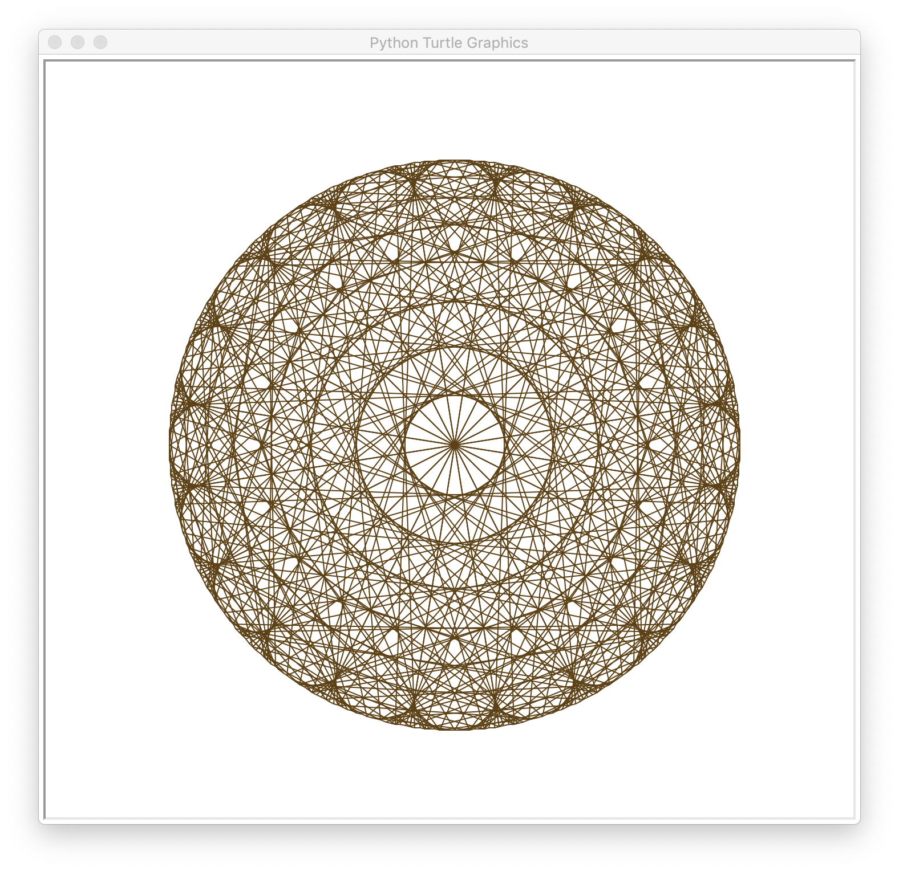
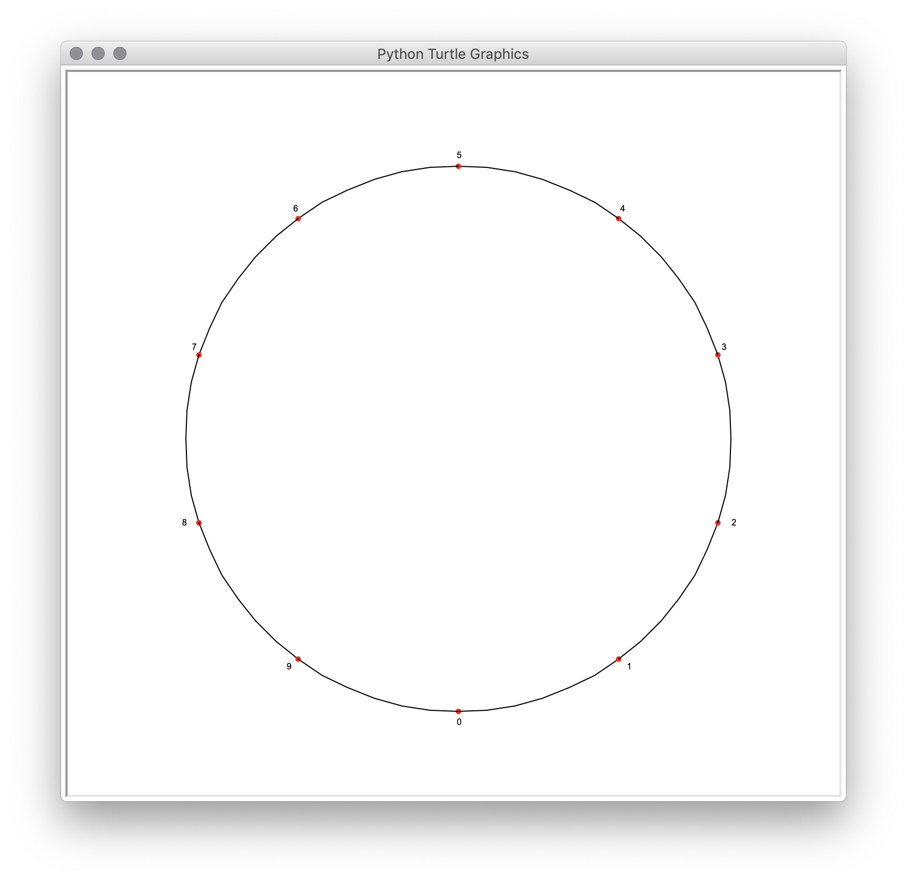
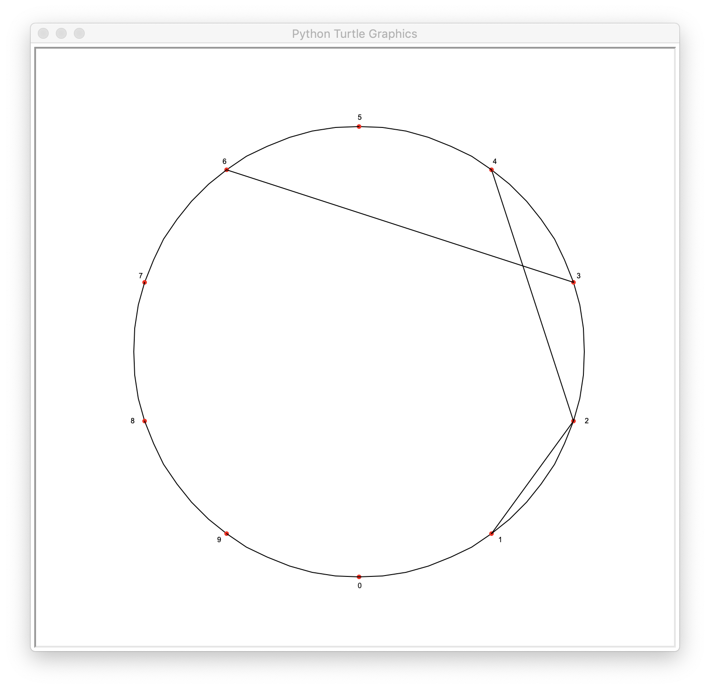
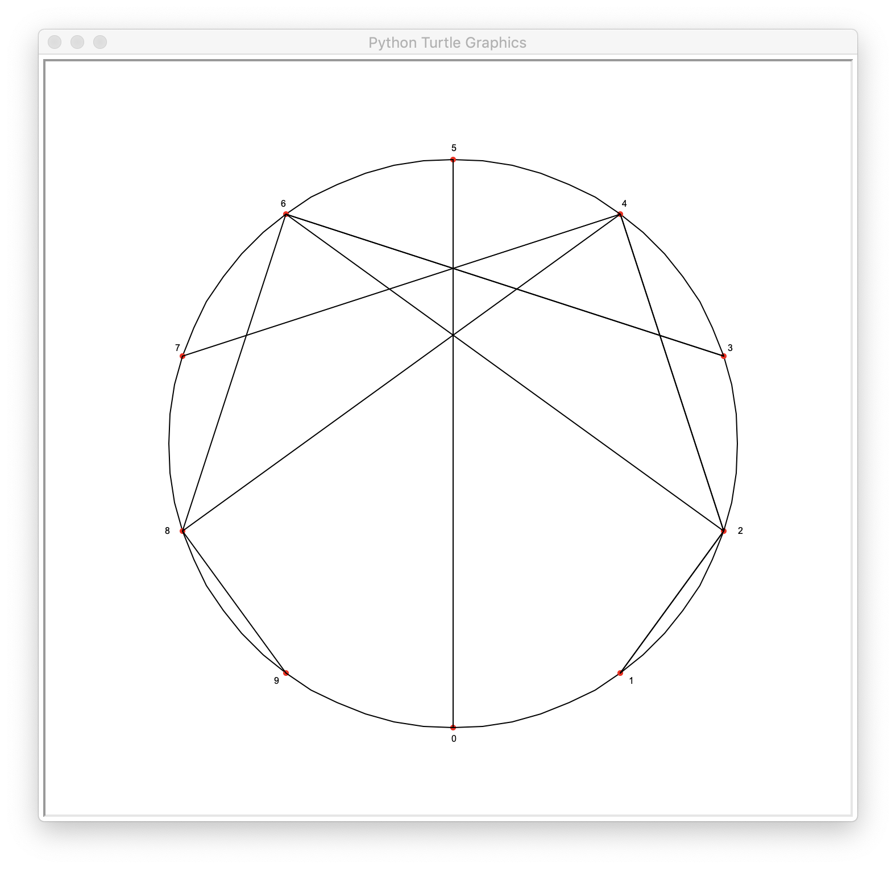
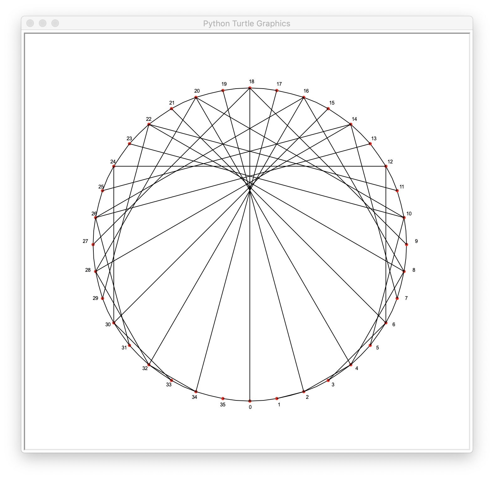
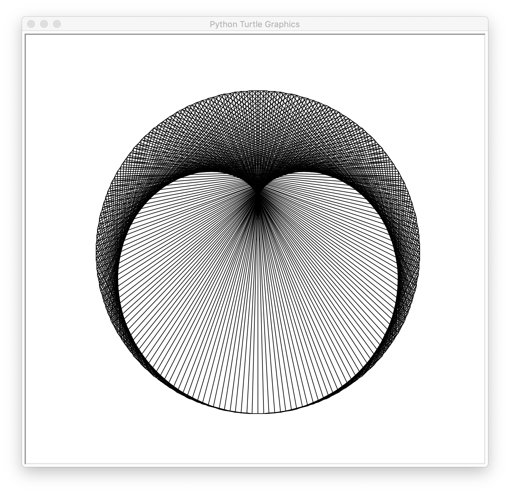
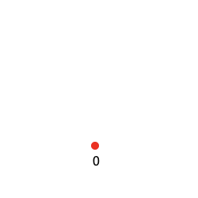
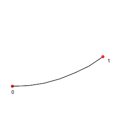
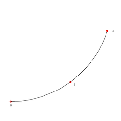

#Dessinons proprement

##Introduction

Nous allons voir comment avec de simples tables de multiplications, un cercle, des segments nous pouvons dessiner de belles rosaces colorées. Nous utiliserons pour cela l'objet Turtle de Python. 

Comme il n'y a aucune difficulté algorithmique, nous en profiterons pour essayer de coder proprement en utilsant deux concepts de *pros* :

- la programmation orientée objet avec héritage
- l'utilisation de la ligne de commande avec options

Avant d'aller plus loin voilà un exemple d'appel à notre script et le résultat obtenu :

    ./rosace.py -m 360 -t 21 -c

##Le principe

###Etape 1

Il nous faut choisir :

1. Une **table** de multiplication, disons 2
2. Un **modulo**, disons 10, nous donnant les entiers de 0 à 9

###Etape 2

Nous dessinons un cercle sur lequel nous représentons nos entiers 0 à 9, comme ceci :

###Etape 3

Nous allons relier certains de ces points en fonction des résultats de la table de multiplication choisie. Par exemple 1 x 2 = 2, nous relions le point correspondant à 1 avec celui correspondant à 2. Puis, 2 x 2 = 4 nous relions le point 2 à 4...

Continuons, 3 x 2 = 6 : un segment entre les points 3 et 6 etc. 5 x 2 = 10, mais il n'y a pas de point 10 ?! Non mais nous allons travailler modulo 10, et donc 10 et 0 sont confondus, de même 6 x 2 = 12 qui modulo 10 vaut 2 etc. Voici l'ensemble de la table 2, modulo 10 :

Bon ça ne ressemble pas vraiment à une rosace ce truc me direz-vous. Certes. Mais voyons en augmentant notre modulo :

Ci-dessous modulo 36 :

Et modulo 360 :

C'est mieux non ? Notre exemple en introduction correspond à un modulo de 360 pour la table de 21 avec une couleur générée aléatoirement. Dans la suite, nous allons voir comment la programmation objet de Python va nous permettre de faire cela.

##L'objet Rosace

Comme nous l'avons vu au chapitre précédent, nous avons besoin d'un premier entier qui est notre table de multiplication, d'un second, notre modulo, nous verrons que pour celui là un diviseur de 360 donnera de meilleurs résultats : les points associés pouvant être répartis de façon équilibrée sur le cercle.

Ainsi notre objet Rosace comporte deux attributs pour le moment, une **table** et un **modulo**. En python, nous allons créer une *fabrique* à Rosace par l'intermédiaire d'une classe :

    class Rosace:

        # ici la définition de notre classe : ces attributs
        # ces méthodes...

Cette classe sera appelée comme ceci pour créer une **instance** de Rosace :

    ma_rosace = Rosace()

Et d'ailleurs notre script final aura comme programme principal le code ci-dessous :

    my_draw = Rosace()
    my_draw.settings()
    my_draw.draw_circle()
    my_draw.draw_segments()
    my_draw.mainloop()

C'est tout ? C'est tout !

1. Création d'une instance de Rosace
2. Récupération des options (la table, le modulo et si on souhaite de la couleur)
3. le dessin du cercle et la création des points
4. le dessin des segments
5. l'instruction spéciale pour que la fenêtre graphique ne se ferme pas tout de suite

En Python, comme dans beaucoup d'autres langages orientés objets, la `class` est ce qui permet de fabriquer des **instances** d'objets. Chaque instance de Rosace aura sa table, son modulo etc. Pour cela, la classe doit définir ce qu'on appelle un **constructeur**. En python ce constructeur porte le nom poétique `__init__` :

    class Rosace:
        def __init__(self):
            self.table = valeur_par_defaut
            self.modulo = une_autre_valeur_par_defaut

Supposons que nous ayons choisi 2 pour la table par défaut et 360 pour le modulo. En faisant :

    ma_rosace = Rosace()

Nous créons une instance de Rosace appelée `ma_rosace` et alors `ma_rosace.table` vaut 2 et `ma_rosace.modulo` vaut 360.

###Comment notre rosace va-t-elle se dessiner ?

Une fois la table et le modulo choisis, il nous faudra une liste de coordonnées correspondant aux entiers 0, 1,... modulo - 1.

Dès lors le dessin des segments se fait par une petite boucle :

    for n in range(1, modulo):
        mul = (table * n) % modulo
        # tracer_segment du point de n vers le point de mul

Oui mais comment dessine-t-on ? L'objet `Turtle` du module turtle de Python va nous aider.

##L'objet Turtle

Le module `turtle` de Python met à notre disposition l'objet `Turtle`permettant, dans une fenêtre graphique de réaliser de petits dessins. Cette *tortue* est un simple crayon posé sur une feuille de papier. Lorsque nous déplaçons ce crayon, sa pointe laisse une trace. Les actions de base sont :

- avancer d'une certaine distance (en pixel pour faire simple)
- tourner à gauche ou à droite
- dessiner un arc de cercle d'un certain rayon
- relever le crayon (pour se déplacer sans dessiner)
- abaisser le crayon
- changer la couleur du crayon
- ...

Toutes ses actions sont réalisées par notre **objet** tortue en appelant les **méthodes** adéquates. 

Le code ci-dessous crée une nouvelle tortue (ce qui aura comme conséquence de créer aussi une fenêtre graphique dans laquelle cette tortue va évoluer) et lui demande d'avancer de 100 pixels.

    # importation du module pour rendre l'objet Turtle disponible
    import turtle

    ma_tortue = turtle.Turtle()
    ma_tortue.fd(100)

Si vous exécutez ce code, vous n'aurez probablement pas le temps de comprendre ce qui se passe, ni de voir votre tortue. En effet le programme se lance, crée une tortue et sa fenêtre graphique, fait avancer cette tortue de 100 pixels puis se termine et alors détruit tortue et fenêtre graphique. Il nous suffit de demander à l'écran associé à notre tortue de rester dans une sorte de boucle infinie... comme ceci :

    ma_tortue.screen.mainloop()

Cette fois vous voyez votre tortue (représentée par une petite flèche noire), et le petit segment qu'elle a dessiné en avançant de 100 pixels. Bien. On constate aussi que cette tortue se tenait au centre de la fenêtre graphique, tournée vers l'Est. 

Le dessin d'un arc de cercle de mesure *alpha* et de rayon *r* se fait par le méthode `circle` :

    ma_tortue.circle(r, alpha)

Et il est important de savoir que cet arc de cercle se fait à partir de la position courante de la tortue, en tournant dans le sens des aiguilles d'une montre (d'où l'intérêt de se positionner en bas de notre fenêtre graphique si on souhaite que notre cercle soit centré dans la dite fenêtre). Se positionner ?! Se positionner ?!!! Mais qu'entend-on par là ? C'est le fait de déplacer son crayon d'un point à un autre sans laisser de trace. Facile avec l'enchaînement de trois méthodes :

    ma_tortue.up()          # je soulève mon crayon
    ma_tortue.goto(x, y)    # je vais au-dessus de point (x, y)
    ma_tortue.down()        # je repose le crayon prêt à dessiner

##Retour à notre Rosace

Quel lien entre notre objet `Rosace` et un objet `Turtle` ? Et bien notre Rosace devant s'auto-dessiner, il serait bon qu'elle possède toutes les caractéristiques d'une tortue, non ? Ainsi, en concept objet on dira que notre objet Rosace **hérite** de `Turtle`. Et ci-dessous la définition finale de `Rosace` :

    class Rosace(turtle.Turtle):
        
        DEFAULT_TABLE = 2
        DEFAULT_MODULO = 10
        DEFAULT_COLOR = 'black'
        RADIUS = 250
        INITIAL_POS = 0, -RADIUS

        def __init__(self):
            self.table = Rosace.DEFAULT_TABLE
            self.modulo = Rosace.DEFAULT_MODULO
            self.pts = []
            turtle.Turtle.__init__(self)

La première ligne définie notre classe `Rosace` comme héritant de la classe `Turtle` du module `turtle`

Puis nous définissons quelque constantes de classe, notamment pour nos valeurs par défaut : table et modulo. Chaque instance sera créée avec ces valeurs par défauts puis, d'éventuelles options permettront de changer ces valeurs. Nous verrons cela plus tard.

Enfin nous avons le constructeur, initialisant les trois attributs dont nous avons déjà parlés : la table, le modulo et la liste des points (vide pour le moment).

###C'est quoi ce self ?

Dans les définitions des méthodes, le premier argument représente **toujours** l'instance qui appelle la méthode. Par convention, on appelle `self` ce premier argument. 

La dernière instruction du constructeur de Rosace mérite également quelques explications. Comme on l'a vu, `Rosace` est une sorte de
`Turtle` finalement, avec des choses en plus. Pour dire à Python que Rosace doit avoir toutes les caractéristiques des autres `Turtle`, il faut explicitement appeler le constructeur de `Turtle`, en lui passant en paramètre l'instance de Rosace qui est en train de se créer ie `self` 

Dès lors, une fois qu'on aura créé notre rosace :

    ma_rosace = Rosace()

On pourra faire des appels comme :

    ma_rosace.fd(100)

D'ailleurs nous pouvons définir notre méthode pour dessiner les segments :

    def draw_segments(self):
        """
        Dessine la multiplication : m = n * self.table pour les
        n de 1 à self.modulo - 1, en liant les points n et m 
        """
        for n in range(1, self.modulo):
            mul = (self.table * n) % self.modulo 
            self.move_to(self.pts[n])
            self.move_to(self.pts[mul], True)

Et la méthode move_to permettant de déplacer le crayon en laissant ou en ne laissant pas de trace suivant la valeur du booléen troisième argument de cette méthode.

    def move_to(self, pos, trace=False):
        if not trace:
            self.up()
        self.goto(pos)
        self.down()

Ceux qui suivent encore auront remarqué que nous utilisons notre liste de points (`self.pts`) mais que cette dernière est toujours vide jusqu'à présent.

###Mémoriser les points

Les coordonnées des points correspondant aux entiers 0, 1, 2 etc. sont quelque part sur le cercle. Nous n'allons faire aucun calcul mais simplement demander à notre tortue de nous donner ces points au fur et à mesure qu'elle va les visiter.

On va se positionner en bas de l'écran (le point 0), puis avancer par arcs de cercle et à chaque pas mémoriser la coordonnée du point courant :

La méthode de l'objet Turtle permettant de récupérer les coordonnées de la position de la tortue s'appelle `pos` Voici donc comment dessiner le cercle et récupérer les coordonnées des points :

    def draw_circle(self):
        """
        Dessine le cercle intial et récupère en même temps les 
        différents points sur ce cercle correspondant aux entiers
        0, 1, 2... self.modulo - 1
        """
        self.move_to(Rosace.INITIAL_POS)
        delta_angle = 360 // self.modulo
        for compteur in range(self.modulo):
            self.pts.append(self.pos())
            self.circle(Rosace.RADIUS, delta_angle)

Encore une fois le code de cette méthode est très simple. Nous commençons par nous positionner an bas de l'écran. Nous calculons la portion d'arc correspondant à un point (soit 360 divisé par le nombre total de points). Il ne reste plus qu'à répéter autant de fois que nécessaire : mémorisation de la position courante et avancer d'un petit arc de cercle.

##Et pour finir : changer les options, rajouter de la couleur

